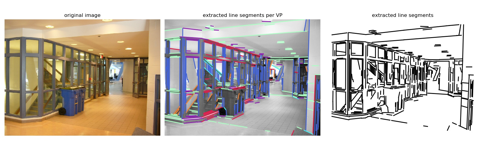

# YUD+: Additional Vanishing Point Labels for the York Urban Database



If you use this dataset and code, please cite [our paper](https://arxiv.org/abs/2001.02643):
```
@inproceedings{kluger2020consac,
  title={CONSAC: Robust Multi-Model Fitting by Conditional Sample Consensus},
  author={Kluger, Florian and Brachmann, Eric and Ackermann, Hanno and Rother, Carsten and Yang, Michael Ying and Rosenhahn, Bodo},
  booktitle={Proceedings of the IEEE Conference on Computer Vision and Pattern Recognition (CVPR)},
  year={2020}
}
```
Please also cite the corresponding [York Urban DB paper](http://elderlab.yorku.ca/YorkUrbanDB/DenisElderEstradaECCV08.pdf)! 


## Prerequisites
In order to use the original RGB images as well, you need to obtain the original 
[dataset MAT-file](http://horatio.cs.nyu.edu/mit/silberman/nyu_depth_v2/nyu_depth_v2_labeled.mat) and convert it to a 
*version 7* MAT-file in MATLAB so that we can load it via scipy:
```
load('nyu_depth_v2_labeled.mat')
save('nyu_depth_v2_labeled.v7.mat','-v7')
```

## Installation
Get the code:
```
git clone --recurse-submodules https://github.com/fkluger/yud_plus.git
cd yud_plus
```

Set up the Python environment using [Anaconda](https://www.anaconda.com/): 
```
conda env create -f environment.yml
source activate yud_plus
```

Build the [LSD line segment detector](https://www.ipol.im/pub/art/2012/gjmr-lsd/) module:
```
cd lsd
python setup.py build_ext --inplace
```

Download the [original York Urban Database](http://elderlab.yorku.ca/YorkUrbanDB), decompress it and place it under 
the ```data``` folder.

## Usage
In order to visualise the dataset, run:
```
python yud.py 
```

For usage within your own project, refer to the ```NYUVP``` class:
```
from yud import YUDVP

dataset = YUDVP(
            data_dir_path="./data",     # Path where the CSV files containing VP labels etc. are stored
            split='all',                # train, val, test, trainval or all
            keep_data_in_memory=True,   # whether data shall be cached in memory
            normalise_coordinates=False,# normalise all point coordinates to a range of (-1,1)
            extract_lines=False         # do not use the pre-extracted line segments
          )
          
idx = 0
sample = dataset[idx] # get a single sample from the dataset
VPs = sample['VPs'] # array Mx3 with vanishing points in homogeneous coordinates
image = sample['image'] # RGB image
lines = sample['line_segments'] # array Nx12 containing all extracted line segments
p1 = lines[:, 0:3] # line segment start points in hom. coordinates
p2 = lines[:, 3:6] # line segment end points in hom. coordinates
hom_lines = lines[:, 6:9] # parametrised line [a,b,c] s.t. ax+by+c=0
centroids = lines[:, 9:12] # centroid = (p1+p2)/2.
```
